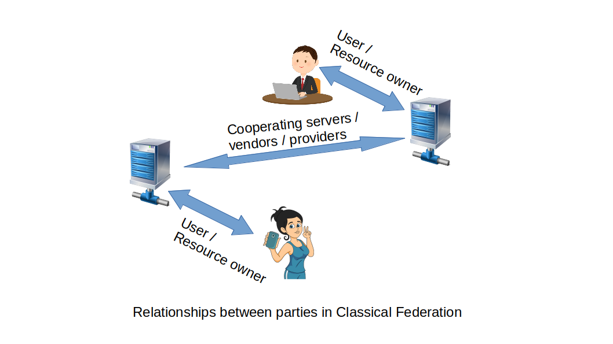
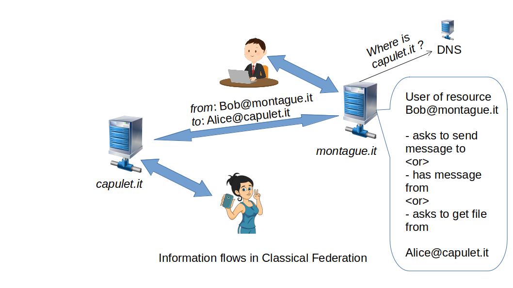
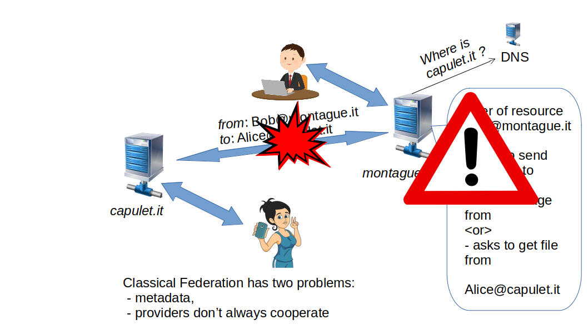
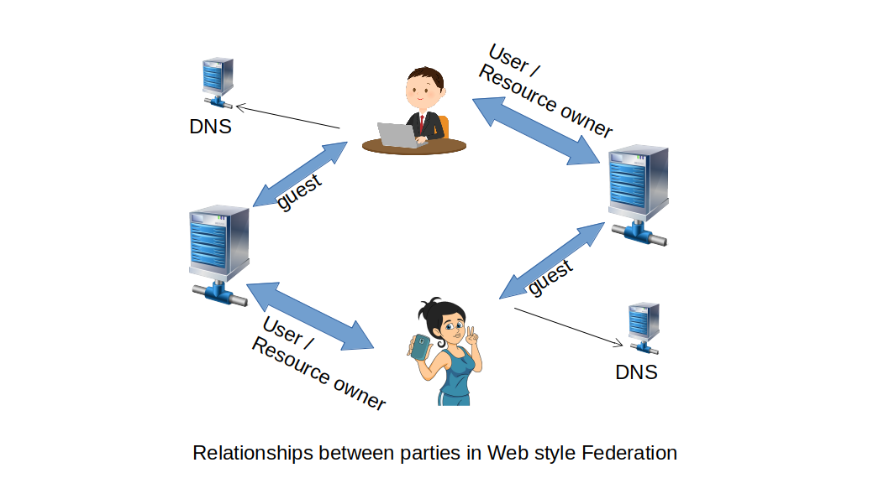

# 3NWeb Architectural Notes

3NWeb is an uncompromisingly user-centric digital space.
Definition of such space has to consist of a bunch of protocols, formats and conventions for writing bodies of software that allow user
 - to operate in a connected cyberspace
 - using one or more devices
 - having a full control over one's tools
 - having a choice of vendors/contractors for underlying tech operations.

3NWeb-following software parts compose together into a coherent operating system for user's stuff in today's digitalized society, ensuring end user's technological sovereignty.

### Content:

 - [Motivation](#part-motivation):
   - [User interests must come first](#section-raison)
   - [Design considerations dictated by wishes](#section-considerations)
 - [Architectural principles](#part-architectural-principles):
   - [The Principle of Least Authority for client-server architectures](#section-pola)
   - [Federated systems, classical vs web styles](#section-federation)
 - Implementations and standards
   - Basic needs: identity, communication and storage
   - Server-client protocols
   - Stack

##  Motivation

###  User interests must come first

Everything in modern society depends on tech. For instance, in Estonia you can't participate in life without electronic id with signatures, and Israel explicitly gives smartphone SIM-cards to newly repatriated. Modern life happens in cyberspace making it an important domain of our environment.
 
> Human dignity and human flourishing are intimately bound up in the ability to shape your environment and make an impact on the world around you, to act, rather than be acted upon.
>
> -- Cory Doctorow

At the start of this century tensions have already been noted in the digital domain (from ["Tussle in Cyberspace: Defining Tomorrow's Internet", DOI 10.1145/633025.633059, August 2002](https://groups.csail.mit.edu/ana/Publications/PubPDFs/Tussle2002.pdf) ):

> 2. PRINCIPLES
>
> The thesis of this paper is that the future of the Internet will increasingly be defined
by tussles that arise among the various parties with divergent interests, and that
the technical architecture of the Internet must respond to this observation. If this is
so, are there principles to guide designers, and mechanisms that we should use in
recognition of this fact?
>
> 6. CONCLUSION
>
> ... We, as technical designers, should not try to deny the reality of the tussle, but instead recognize our power to shape it. Once we do so, we acquire a new set of hard, technical problems to solve, and this is a challenge we should step up to willingly.
>

Over the next two decades we've seen a rise of monopolists and even talks about [digital feudalism](https://www.schneier.com/blog/archives/2012/12/feudal_sec.html). 2020 saw [RFC 8890](https://www.rfc-editor.org/rfc/rfc8890.txt) with:

> 3. Why the IETF Should Prioritize End Users
>
> Merely advancing the measurable success of the Internet (e.g., deployment size, bandwidth, latency, number of users) is not an adequate goal; doing so ignores how technology is so often used as a lever to assert power over users, rather than empower them.
>
> Beyond fulfilling the IETF's mission, prioritizing end users can also help to ensure the long-term health of the Internet and the IETF's relevance to it.  Perceptions of capture by vendors or other providers harm both; the IETF's work will (deservedly) lose end users' trust if it prioritizes (or is perceived to prioritize) others' interests over them.
>
> Ultimately, the Internet will succeed or fail based upon the actions of its end users, because they are the driving force behind its growth to date.  Not prioritizing them jeopardizes the network effect that the Internet relies upon to provide so much value.
>

There are applications like PGP, SpiderOak, Signal, with designs that place user in control of their stuff. These are celebrated examples cause the majority isn't like them. Currently it is easier to make centralized design, placing user stuff into piles that both attract hacker with size and seduce vendors with monopolistic control, leading to fatalistic notes in a public discourse.

3NWeb comes from a premise that when it is easy to develop user-respecting apps, when it is cheaper to operate user-respecting system, then we'll see more of them, making respect of user a norm.

3NWeb effort brings known working designs into a coherent foundation on top of which different applications can be written by developers.

###  Design considerations dictated by wishes

#### Data encryption, metadata and 3rd parties

In a usual human interaction, when a person is not giving out own information, it doesn't spread by itself.

To map usual expectations to digital domain, we want to ensure tight information control. Thankfully, encryption allows to turn plain text content to bulk cipher and a key. Hence, in our designs bulk bytes can pass through third parties only in cipher form, with as little metadata as possible.

#### Longevity

Human life spans long period, over which artifacts collect, and, for example, a grandfather can show pictures to one's grandchild.

We want to have the same timelessness with digital artifacts. On a stand-alone computer you can open CorelDraw file, and you may even run some old WordPerfect program on an old operating system inside a virtual machine. Digital longevity is attainable. Hence, we design an environment in which users can have applications usable long after original developer company is gone.

#### Permissionless innovation

It should be easy to write applications, as easy as writing a web page. And no permissions should be needed to participate in the ecosystem. Everything short of permissionless model gets abused by monopolistic tendencies.

#### User freedom

User should be able to completely rely on one's own devices, and be able to choose, to mix and match suppliers. Users shouldn't be bound to only single vendor, or only single implementation of major utility functions on which plethora of useful apps runs.

#### Multi-device convenience

People now have several devices. Applications should be able to run on several user devices at once. Applications should be able to pass messages between different users, as well.

##  Architectural principles

###  The Principle of Least Authority for client-server architectures

Client-server systems are used everywhere, they are efficient. Often clients pass some data to server, and this becomes a magnet for bad actors. Any bit of passed data and meta-data comes with an implicit authority that gets abused. We should apply the Principle of Least Authority (POLA).

Let's formulate POLA in terms relevant to client-server communications as 3N's:
 - No plain text user content should be given to server.
 - No unnecessary metadata should be present or generated in client-server interaction.
 - Nothing can be abused on the server, when the first two criteria are met.

We use 3N principle every time in assesing protocols' designs. The first N is met by end-to-end encryption (E2EE), and in principle this is a solved problem. The second N, the metadata part, will take more consideration and specific tricks for particular services.

###  Federated systems, classical vs web styles

#### Classical Federation

Federated service is commonly assumed to be a pattern used in many protocols like XMPP, SMTP (common email), Matrix, etc. We call this pattern classical federation.

Relationships between parties in classical federation look as follows.

Users have accounts at servers. User is owner of some resource on the respective server. Users connect only to their own servers, while servers talk to each other, cooperatively passing data.

Effectively users delegate to their servers work of getting and passing data. But this delegation requires user to pass to servers lots of metadata, which goes against security goal of minimizing metadata spills.

Besides metadata problem, cooperative relationship between servers requires cooperation. But the world have seen a few examples of bigger vendors stopping cooperation, breaking user experience of communication with users of other vendors.

#### Web style Federation

## Implementations and standards

*Have diagram with client, server and parts in a client.*
*Have a table like in presentation, from which every protocol/api is a link to respective md file*

Docs writting is in progress, but see an existing [Overview and architecture](./etc/3NWeb-overview.pdf) with more details about specs.

