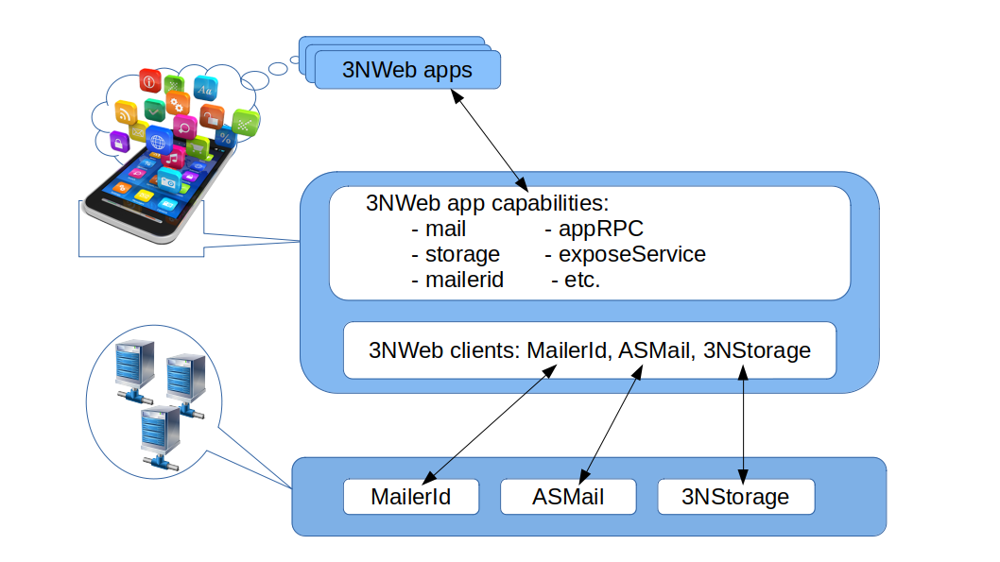

# 📐 Architecture Overview

This repository contains architectural notes and specifications for the open 3NWeb protocols, formats, and conventions. These protocols define how apps and services can be built to prioritize user control, privacy, and sovereignty in the digital age. We describe an uncompromisingly user-centric digital space that empowers users to: 

- Operate in a connected cyberspace  
- Use multiple devices fluidly  
- Maintain full control over their tools and data  
- Choose between different vendors and service providers  

These components collectively function as an OS-like environment.

> ✅ Want to see this in action? Check out the full implementation at [PrivacySafe](https://privacysafe.app) — a powerful suite of secure, end-user apps built using these protocols, and actively developed at [github.com/PrivacySafe](https://github.com/PrivacySafe). As of 2025, apps for Chat, Inbox, Contacts, Storage, and an App Store updater & launcher have been released as a bundle with documentation at [github.com/PrivacySafe/privacysafe-userguides](https://github.com/PrivacySafe/privacysafe-userguides)

> ⚙️ Technical readers can explore 3NWeb's specifications, protocols, and APIs and contribute to them as part of [IEEE SA Open](https://opensource.ieee.org/3nweb).

## 📚 Table of Contents

- [Architecture Overview](#-architecture-overview)
- [Motivation](#-motivation)
  - [Why Users Come First](#-why-users-come-first)
  - [Design Goals Rooted in the Real-World](#-design-goals-rooted-in-the-real-world)
- [Architectural Principles](#-architectural-principles)
  - [Least Authority in the Client-Server Model](#-least-authority-in-the-client-server-model)
  - [Federation: Classical vs. Web-Based](#-federation-classical-vs-web-based)
    - [Classical Federation](#-classical-federation)
    - [Web-Style Federation](#-web-style-federation)
- [Implementation & Standards](#-implementation--standards)
  - [On the Client](#-on-the-client)
  - [User IDs & Identity](#-user-ids--identity)
  - [Service Discovery](#-service-discovery)
  - [Protocol Layers & Components](#-protocol-layers--components)
    - [MailerId: Verifiable & Private Identity](#-mailerid-verifiable--private-identity)
    - [ASMail: Secure E2EE Messaging](#-asmail-secure-e2ee-messaging)
    - [3NStorage: Encrypted Network Storage](#-3nstorage-encrypted-network-storage)
- [Contributing](#-contributing)
- [License](#-license)

## 💡 Motivation

### 👥 Why Users Come First

Our digital lives demand the same human rights and autonomy we expect offline. Despite this need, modern communication systems are often designed to serve institutions — not the people who use the software and hardware platforms.

> “Human dignity and human flourishing are intimately bound up in the ability to shape your environment and make an impact on the world around you, to act, rather than be acted upon.” 
> — *Cory Doctorow*

Measuring the success of the Internet by technical metrics (e.g., deployment size, bandwidth, latency, number of users) is not adequate to comprehend modern challenges. Merely doing so ignores how technology is often used as a lever to assert power over users, rather than empower them. From government services to social interactions, technology functions as a gatekeeper. When users aren’t in control, those gates can lock people out.

We believe that standards organizations should prioritize technologies that empower end users. Beyond fulfilling an organizations’s mission, this helps to ensure the long-term health of the Internet and that organization’s relevance to it. Ultimately, the Internet will succeed or fail based upon the actions of its end users: they are the driving force behind its growth. Not prioritizing users — as actual, real people with autonomy and choice — jeopardizes the network effects that the Internet relies upon to provide its incredible value.

Researchers have long warned about conflicts and friction in information systems. From the 2002 paper ["Tussle in Cyberspace"](https://groups.csail.mit.edu/ana/Publications/PubPDFs/Tussle2002.pdf) to [RFC 8890](https://www.rfc-editor.org/rfc/rfc8890.txt) in 2020, experts argue that technology must empower users — not just providers or platforms. Otherwise, our societies can start to resemble [digital feudalism](https://www.schneier.com/blog/archives/2012/12/feudal_sec.html).

As creators, designers, and engineers, we do not try to deny the reality of conflict in information systems. Instead, we recognize our power to shape reality and build new systems to replace old ones. Once we do so, we acquire a new set of hard, technical problems to solve, and this is a challenge we meet willingly.

### 🌎 Design Goals Rooted in the Real-World

- 🔐 **Private by design**: Data is encrypted before transit, with metadata minimized at every layer.
- 📆 **Long-term resilience**: Formats are stable and portable. Users can continue accessing their data long after the original developers or services are gone.
- 🧠 **Permissionless innovation**: Anyone can build apps without centralized approval.
- 💭 **Vendor choice**: Users must be able to rely on their own devices and choose their infrastructure freely.
- 📱 **Multi-device support**: Data and apps should move seamlessly across a user's own devices.
- 🏠 **App-site separation**: Users own and control the apps they run. Sites (shared app spaces) are hosted extensions — not centralized dependencies.

## 🔒 Architectural Principles

### 🔏 Least Authority in the Client-Server Model

Client-server models dominate the internet, but they often violate privacy principles. By applying the **Principle of Least Authority (POLA)**, we can reframe these designs to minimize abuse and data leakage.

> The **3N Principle** applied here:
>
> 1. **No plain-text content** is sent to servers  
> 2. **No unnecessary metadata** is included in client-server exchanges  
> 3. **Nothing on the server** can be exploited if (1) and (2) are respected

While a few efforts like [PGP/GPG](https://www.ietf.org/archive/id/draft-koch-openpgp-2015-rfc4880bis-02.html) have succeeded in giving users true data control, they remain the exception. The dominant technologies favor centralized systems where user data is aggregated. This often introduces security and privacy risks. We seek to make user-respecting design the **default**. By lowering the barrier to develop secure, private apps and making it more economical to run them, we shift the baseline toward ethical digital systems.

Apps built using our stack aim to replace centralized “cloud” tools while preserving user freedom, metadata minimization, and offline access.

### 🌐 Federation: Classical vs. Web-Based

#### 🔁 Classical Federation

Popular in systems like [Jabber/XMPP](https://xmpp.org/rfcs/) or [Matrix](https://spec.matrix.org), this model relies on inter-server cooperation. Each user connects to their “home” server, which then talks to peers’ servers.


Users have accounts at servers. A user owns some resource on their home server and connects only to it, while servers relay messages on their behalf.


**Problems:**
- Requires trust in cooperating vendors
- Leaks metadata due to server-level routing
- Can break if large players refuse to interoperate


#### 🕸️ Web-Style Federation

In contrast, the web model treats each domain or server as autonomous. There is **no expectation of cooperation** between servers. Apps communicate **peer-to-peer**, only as needed.

**Benefits:**
- Minimal metadata
- Easier to preserve privacy
- No dependency on large vendor coordination


## 🛠️ Implementation & Standards

The protocols here form the foundation for secure, app-centric systems. Real-world applications like those in the [PrivacySafe Suite](https://privacysafe.app) demonstrate these designs in action.

### 💻 On the Client

Apps rely on a platform layer that provides secure services: file access, networking, cryptography, and more. Capabilities are granted based on app manifests — a clear, auditable permission system.


Each capability corresponds to a standard service:

- 📩 **Messaging** → [ASMail protocol](./protocols/asmail/README.md)
- 📂 **Storage** → [3NStorage protocol](./protocols/3nstorage/README.md)
- 🔑 **Identity** → [MailerId protocol](./protocols/mailerid/README.md)

Additional utilities connect apps to the OS or other services securely.

Apps use a [manifest file](./app-manifest/README.md)) to declare required capabilities. These capabilities may also include services that help compose multiple apps into a coherent system on user devices.



- 🎨 **App Composition Tools**:
  - `appRPC`: Connects to components within the same app.
  - `otherAppsRPC`: Connects to services provided by other apps.
  - `exposeService`: Publishes services for other apps to use. For instance, when porting a traditional web app to 3NWeb, backend functions like cloud lambdas are refactored as services exposed here via RPC.

- 🔢 **Runtime Utilities**:
  - `connectivity`: Detects if the client is offline.
  - `closeSelf`: Allows an app to terminate its own process.
  - `log`: Sends errors and warnings to the platform log.

- 📁 **OS Integration Utilities**:
  - `shell.fileDialog`: Opens native file selection dialogs.
  - `shell.mountFS`: Mounts a 3NWeb storage folder for access by traditional (non-3NWeb) programs.
  - `shell.userNotifications`: Sends native notifications through the device OS UI.

- ⚙️ **Platform Services**:
  - `logout`: Logs out the user, shuts down core processes, and clears memory-resident keys.
  - `apps.opener`: Opens 3NWeb apps when triggered by the user.
  - `apps.downloader`: Finds and downloads new 3NWeb apps, or updates existing ones.
  - `apps.installer`: Installs new apps into the user’s platform.
  - `platform`: Checks for updates to the platform software itself.

### 👤 User IDs & Identity

Each user is globally identifiable via a `<username>@domain` format, similar to email or instant messaging protocols. Identity resolution follows canonical rules: no whitespace, case-insensitive.

Example:  
`Bob Marley @3nweb.com` becomes `bobmarley@3nweb.com`

### 🔎 Service Discovery

Services are discovered via DNS `TXT` records or `.well-known` endpoints on [Tor](https://spec.torproject.org). This approach decouples domain ownership from server location, enabling flexible deployment and decentralization.

Example DNS entries:

```
asmail=3nweb.net/asmail
mailerid=mailerid.org
3nstorage=3nweb.net/3nstorage
```

### 🔧 Protocol Layers & Components

#### 🔑 MailerId: Verifiable & Private Identity

Inspired by [Mozilla Persona/BrowserID](https://github.com/mozilla/persona), this protocol issues verifiable identity certificates while preserving user anonymity on servers. Clients sign requests and services verify them without tracking.

[See full details](./protocols/mailerid/README.md)

Although Mozilla Persona/BrowserID was technically solid, its centralized identity provider introduced tracking risks, ultimately exploited by researchers to show possible surveillance vectors.

3NWeb’s MailerId keeps the robust certificate chain design of BrowserID, but eliminates tracking by decentralizing trust roots, removing reliance on persistent browser storage, and enabling clients to rotate keys independently. Identity assertions are always signed client-side, and **no identity provider knows where or when they’re used** — enforcing strict separation of concerns.

#### 📩 ASMail: Secure E2EE Messaging

Messages are end-to-end encrypted (E2EE), with the sender identity revealed only to the recipient. No message content or metadata is visible to the server.

  
[See full spec](./protocols/asmail/README.md)

#### 📂 3NStorage: Encrypted Network Storage

Encrypted blobs are stored without filenames, structure, or metadata. Clients reconstruct file systems locally. Versioning and events enable sync across devices.

  
[See full spec](./protocols/3nstorage/README.md)

## ✨ Contributing

Contributions are welcome! Please fork, remix, and create pull requests as part of [IEEE SA Open](https://opensource.ieee.org/3nweb). Happy Hacking 🤓

Never send sensitive info about you or other users via direct message or email.

* **Bugs & Security Issues:** See [SECURITY.md](SECURITY.md) for more information.

## 📜 License

© 2014–present Mikalai Birukou & Sean O'Brien and contributed under the [IEEE SA Open CLA](https://opensource.ieee.org/community/cla/apache). This project is dedicated to ethical [Free and Open Source Software](https://fsf.org) and [Open Source Hardware](https://oshwa.org). Please note that 3NSoft®, 3NWeb® and PrivacySafe® are registered trademarks.

Released under the [Apache 2.0 License](LICENSE). See [LICENSE](LICENSE) for more information.
