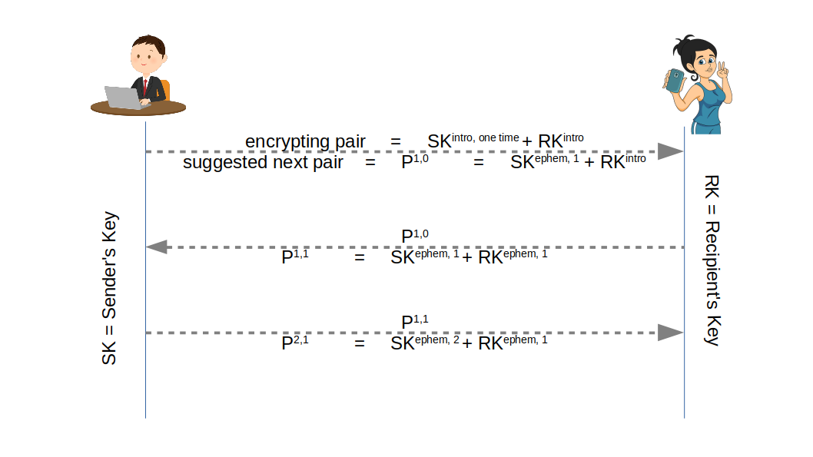
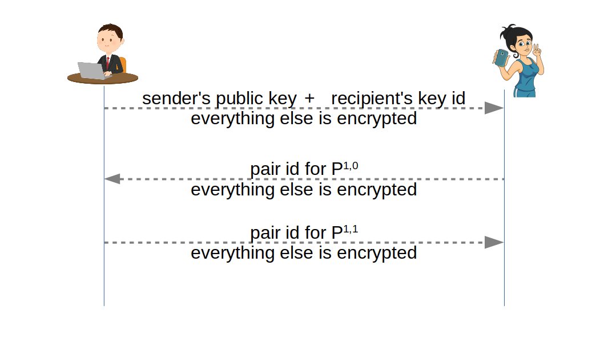

# Mail capability

For communication with ASMail servers client-side platform uses [ASMail protocol](../../protocols/asmail/README.md). And this protocol only passes encrypted blobs, while clients take care of encryption and keys.

Mail capability inside client platform keeps track of of keys used to communicated with different peers. Each message is encrypted with its own randomly generated key, but it itself is encrypted using public key cryptography. Public keys of peers are also rotate to reduce leakage from breaches.

When peers have randomly generated keys, they are unique, and correct key to message implies peer from who the message must've come. If messages have no hint to what keys are used, recipient has to try all keys to find correct one. Protocol allows passing key pair label to help client find the right key faster.

[This implementation](https://github.com/3nsoft/core-3nweb-client-lib/tree/master/ts-code/core/asmail) uses short random pair ids ensuring small average number of decryption attempts without turning pair id into a pseudonymous identifier of sender.

Message is one or more encrypted blobs. Main object contains encrypted json, defined with [MsgStruct definition](https://github.com/3nsoft/core-3nweb-client-lib/blob/master/ts-code/api-defs/asmail.d.ts#L208). Attachments are regular files and folders of 3NStorage file system. Attachments' holding root folder is placed into main object json. Respective encrypted objects are passed as part of the message.

App-facing platform side standardizes on protobuf forms of [messages passed between platform and app](https://github.com/3nsoft/core-3nweb-client-lib/blob/master/protos/asmail.proto). Additionally, 3NWeb standards may also include language specific forms, like [this TypeScript definitions](https://github.com/3nsoft/core-3nweb-client-lib/blob/master/ts-code/api-defs/asmail.d.ts).

Together with defining app-facing message standard we will also specify actual tests, [like](https://github.com/3nsoft/core-3nweb-client-lib/blob/master/ts-code/tests/apis/asmail.ts) [these ones](https://github.com/3nsoft/core-3nweb-client-lib/tree/master/ts-code/tests/apis/asmail), giving a tool to check implementations of platform from app-facing side.

*Docs are work in progress, but links to code point to working implementation, to at least give a gist of technical nuances.*
