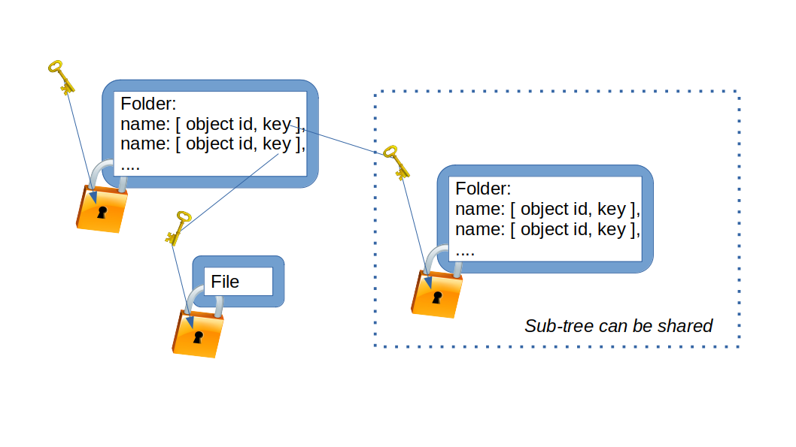

# 📁 Storage Capability

Most apps need storage, and a simple file system is the most basic form expected by app developers. However, any storage uploaded to servers should not expose content or metadata. To communicate with 3NStorage servers, the platform uses the [3NStorage protocol](../../protocols/3nstorage/README.md).

3NStorage uses blobs, each labeled with a randomly generated ID (object ID). The content of these blobs is encrypted in the [XSP format](xsp_format.md), which supports changes, checks, versioning, and more. XSP is designed for use with the [NaCl](http://nacl.cr.yp.to/) crypto library, providing a simple API surface. Future versions may include alternative libraries as optional sections within the 3NWeb standards.

Currently, there are two versions of content encrypted in XSP objects. [Version 1](https://github.com/PrivacySafe/core-3nweb-client-lib/blob/master/ts-code/lib-client/3nstorage/xsp-fs/xsp-payload-v1.ts) consists of raw bytes without any file system info. [Version 2](https://github.com/PrivacySafe/core-3nweb-client-lib/blob/master/ts-code/lib-client/3nstorage/xsp-fs/xsp-payload-v2.ts) includes sections that allow for randomly placed writes on the app’s side, making the writes appear as append-only. This simplifies synchronization and helps obfuscate the file write pattern from servers, enhancing security.

The [implementation](https://github.com/PrivacySafe/core-3nweb-client-lib/tree/master/ts-code/lib-client/3nstorage/xsp-fs) explains how file system entities are organized in bytes. We'll eventually formalize this into an explicit format standard. For now, it's key to note that each object is encrypted with its own randomly generated key, which is stored in the parent folder.

This cascade of encryption keys allows file system subtrees to be shared securely, without exposing keys elsewhere.

Apps don’t always need to sync data across devices. For purely local storage, the same encryption and packing methods are used as for synced storage. The difference is that local storage lacks syncing functionality, while all persistent data on disks remains encrypted with minimal metadata leaks ([see code](https://github.com/PrivacySafe/core-3nweb-client-lib/tree/master/ts-code/core/storage)).

App-facing platforms standardize communication with protobuf messages for [storage](https://github.com/PrivacySafe/core-3nweb-client-lib/blob/master/protos/storage.proto), [files](https://github.com/PrivacySafe/core-3nweb-client-lib/blob/master/protos/file.proto), and [file systems](https://github.com/PrivacySafe/core-3nweb-client-lib/blob/master/protos/fs.proto). 3NWeb also offers language-specific implementations, such as [TypeScript definitions](https://github.com/PrivacySafe/core-3nweb-client-lib/blob/master/ts-code/api-defs/files.d.ts).

We provide tests, like [these](https://github.com/PrivacySafe/core-3nweb-client-lib/blob/master/ts-code/tests/apis/storage.ts), [these](https://github.com/PrivacySafe/core-3nweb-client-lib/tree/master/ts-code/tests/apis/fs-checks), and [these](https://github.com/PrivacySafe/core-3nweb-client-lib/tree/master/ts-code/tests/apis/file-sink-checks) to ensure compliance with the platform’s standards.

---
The documentation is a work in progress. For active deployment details, refer to the [PrivacySafe](https://github.com/PrivacySafe) implementation.
