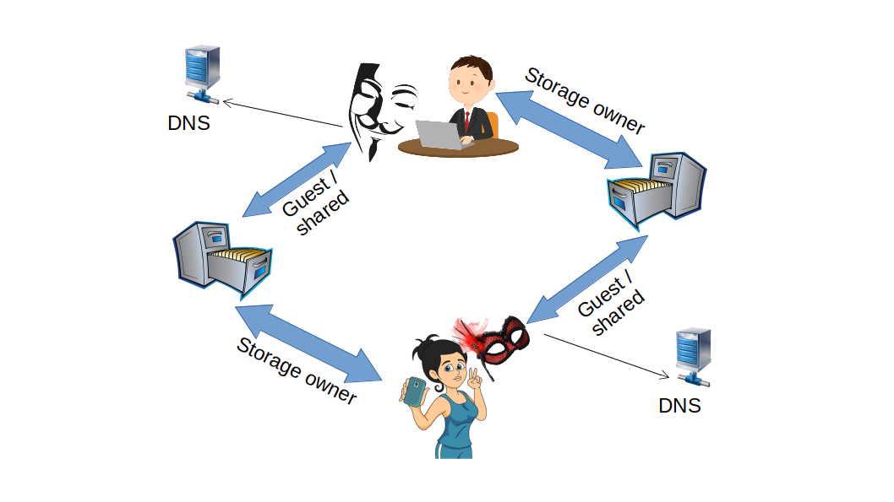

# 3NStorage protocol

Docs are work in progress. For now we can point to [docs-like definitions](https://github.com/3nsoft/spec-server/tree/master/ts-code/lib-common/service-api/3nstorage).

Together with protocol definition we will also specify actual tests, [like these ones](https://github.com/3nsoft/spec-server/tree/master/ts-code/tests/protocols/3nstorage), giving a tool to check implementations of 3NStorage service.
