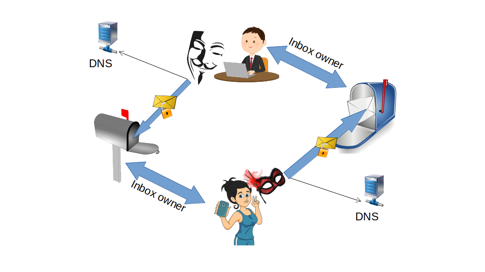

# 💌 ASMail protocol

Read the [ASMail definition](https://github.com/PrivacySafe/core-3nweb-client-lib/blob/master/ts-code/api-defs/mailerid.d.ts).

Together with the protocol definition,  we specify tests [like these](https://github.com/PrivacySafe/spec-server/tree/master/ts-code/tests/protocols/asmail) which provides the capability to check implementations of the ASMail service.

---
The documentation is a work in progress. For active deployment details, refer to the [PrivacySafe](https://github.com/PrivacySafe) implementation.
