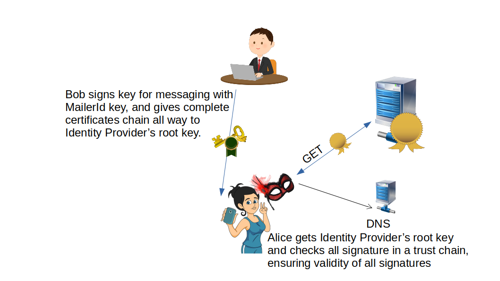

# 💌 MailerId Protocol

The MailerId process involves three parties:
1. The identity provider (identity service)
2. The user of the identity service
3. The relying party, to whom the user wants to prove their identity

In the first stage, called the provisioning stage, the user generates a signing key pair, logs into the service, and requests the identity provider to create (provision) a certificate for their public key.

The user's certificate remains valid until it expires, so the provisioning step doesn’t need to be repeated for a while (usually a few hours).

User login in MailerId is done via the [Public Key Login (PKL) process](../pkl/README.md). PKL eliminates the need for a browser, removing the vulnerabilities found in BrowserID.

With a provisioned certificate for their signing key, the user can sign other public keys. For example, the ASMail introductory key should be signed with the MailerId key.

When Alice (the relying party) needs to verify a key that claims to belong to `Bob@montague.it`, the following steps occur:
1. The DNS record for `montague.it` is checked to find the location of the MailerId service.
2. The provider's root certificate is retrieved from the service location with a request that all relying parties can use. This request contains no information about either the user or the relying party, in line with the Principle of Least Authority (POLA).
3. Alice verifies the entire certificate chain, ensuring that all signatures and certificates are valid.

MailerId has a login sequence similar to that of [Mozilla Persona/BrowserID](https://github.com/mozilla/persona). Although Mozilla Persona/BrowserID was technically solid, its centralized identity provider introduced tracking risks, ultimately exploited by researchers to show possible surveillance vectors.

3NWeb’s MailerId keeps the robust certificate chain design of BrowserID, but eliminates tracking by decentralizing trust roots, removing reliance on persistent browser storage, and enabling clients to rotate keys independently. Identity assertions are always signed client-side, and **no identity provider knows where or when they’re used** — enforcing strict separation of concerns.

Please read the [MailerId definitions](https://github.com/PrivacySafe/spec-server/tree/master/ts-code/lib-common/service-api/mailer-id) for more information.

Along with the protocol definition, we will specify tests, such as [these](https://github.com/PrivacySafe/spec-server/blob/master/ts-code/tests/protocols/mailerid.ts), which provide a tool to check implementations of the MailerId service.

---
The documentation is a work in progress. For active deployment details, refer to the [PrivacySafe](https://github.com/PrivacySafe) implementation.
